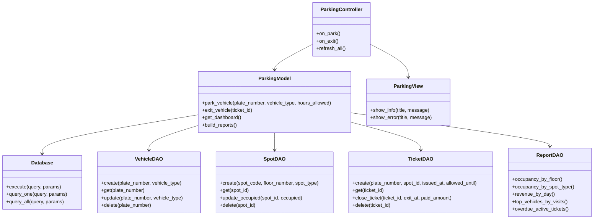

# Parking Management System (MVC + GUI + SQLite)

## 1) Project Title
Parking Management System

## 2) Description
Parking Management System is a desktop application for managing parking operations with a user-friendly graphical interface. The system is designed using the MVC pattern, stores data in SQLite, applies parking pricing rules, validates user input, and provides analytical reports for monitoring parking efficiency.

## 3) Project Requirements List (10+ key functionalities)
1. Register vehicle entry with plate number, type, and parking hours.
2. Automatically assign a suitable free parking spot by vehicle type.
3. Generate parking ticket and store it in the database.
4. Register vehicle exit by ticket ID.
5. Calculate payment with base price and overtime fine.
6. Display active tickets in GUI table.
7. Show live dashboard with total/free/occupied spots and active tickets.
8. Validate wrong user input and show exception notifications.
9. Persist data in SQLite database.
10. Apply DAO classes for CRUD operations.
11. Provide multiple database reports (5+ reports available).
12. Unit tests for Model business logic.

## 4) Team Members List
- Askarbekov Bayel
- Sultanova Nurjanat

## 5) Roles of Group Members
- Sultanova Nurjanat - database
- Askarbekov Bayel - parking management system

## 6) Contributors
- Sultanova Nurjanat
- Askarbekov Bayel

## 7) MVC Architecture
- Model: `ParkingModel`, DAO classes (`VehicleDAO`, `SpotDAO`, `TicketDAO`, `ReportDAO`), validation and pricing logic.
- View: `ParkingView` (Tkinter GUI with dashboard, forms, active tickets table, reports panel).
- Controller: `ParkingController` (handles user actions and updates UI).

## 8) Database Design (3+ tables)
Implemented tables:
- `vehicles` (plate_number, vehicle_type)
- `parking_spots` (spot_code, floor_number, spot_type, occupied)
- `tickets` (issued_at, allowed_until, exit_at, paid_amount, status, relations)

## 9) DAO and CRUD
DAO classes provide CRUD support:
- `VehicleDAO`: create/get/update/delete/list
- `SpotDAO`: create/get/update/delete/list
- `TicketDAO`: create/get/close/delete/list

## 10) Reports from Database (5+)
Implemented reports:
1. Occupancy by floor
2. Occupancy by spot type
3. Revenue by day
4. Top vehicles by visits
5. Overdue active tickets
6. Average parking duration

## 11) UML Class Diagram


## 12) Running the Project
```bash
python parking_management_system.py
```

## 13) Unit Tests
```bash
python -m unittest -v
```

## 14) Submission
Submit the GitHub repository link after completing:
- Project requirements implementation
- Team member list and role assignment
- README + UML + screenshots
- Stable commit history
- Presentation slides
